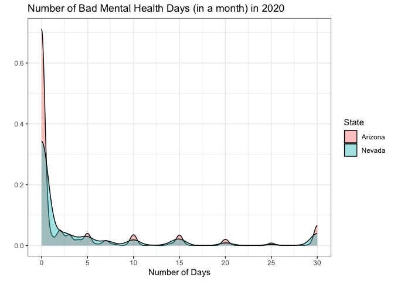

BST260 Code and Plots
================
2022-12-15

## Read in Behavioral Risk Factor Surveillance System data from 2010

``` r
brfss10 <- read_xpt("/Users/kierantodd/Desktop/CDBRFS10.XPT",
                    col_select = c(`IYEAR`,`_STATE`, `STOPSMK2`)) %>%
  as.data.table() %>%
  setnames(old = c("IYEAR","_STATE", "STOPSMK2"), new = c("YEAR","STATE", "MENTHLTH"))
```

## Read in Behavioral Risk Factor Surveillance System data from 2020

``` r
brfss20 <- read_xpt("/Users/kierantodd/Desktop/LLCP2020.XPT",
                    col_select = c(`IYEAR`,`_STATE`, `STOPSMK2`)) %>%
  as.data.table() %>%
  setnames(old = c("IYEAR","_STATE", "STOPSMK2"), new = c("YEAR","STATE", "MENTHLTH"))
```

\##Combine BRFSS 2010 and BRFSS 2020 mental health data by State

``` r
brfss_all <- rbindlist(list(brfss10, brfss20), use.names = T)
brfss_all <- na.omit(brfss_all)
```

\##Filter by Nevada and Arizona for the simple 2x2
difference-in-differences model

``` r
brfss_all <- brfss_all |> 
  filter(STATE %in% c("5", "32")) |>
  select(STATE, YEAR, MENTHLTH) %>%
  mutate(outcome = case_when(
    MENTHLTH == 88 ~ 0,
    MENTHLTH == 77 ~ NA_real_,
    MENTHLTH == 99 ~ NA_real_,
    TRUE ~ MENTHLTH))

na.omit(brfss_all)
```

    ##       STATE YEAR MENTHLTH outcome
    ##    1:     5 2010        2       2
    ##    2:     5 2010        1       1
    ##    3:     5 2010        2       2
    ##    4:     5 2010        2       2
    ##    5:     5 2010        2       2
    ##   ---                            
    ## 2621:    32 2020        2       2
    ## 2622:    32 2020        1       1
    ## 2623:    32 2020        2       2
    ## 2624:    32 2020        2       2
    ## 2625:    32 2020        2       2

\##Rename States by their FIPS codes to the State Abbreviations

``` r
brfss_all$STATE = ifelse(brfss_all$"STATE" == 5,"Arizona","Nevada")
```

\##Further clean data so that only 2010 and 2020 interview dates exist,
also omit any rows that have no values

``` r
brfss_analysis <- brfss_all %>% filter(YEAR %in% c(2010,2020))
brfss_analysis <- na.omit(brfss_analysis)
```

\##run a simple 2x2 difference in difference model using linear
probablility model

``` r
did_model1 <- lm(outcome ~ factor(STATE)*factor(YEAR), data=brfss_analysis)
summary(did_model1)
```

    ## 
    ## Call:
    ## lm(formula = outcome ~ factor(STATE) * factor(YEAR), data = brfss_analysis)
    ## 
    ## Residuals:
    ##     Min      1Q  Median      3Q     Max 
    ## -0.5432 -0.5060  0.4568  0.4940  7.5201 
    ## 
    ## Coefficients:
    ##                                      Estimate Std. Error t value Pr(>|t|)    
    ## (Intercept)                           1.47994    0.02135  69.303   <2e-16 ***
    ## factor(STATE)Nevada                   0.02610    0.02998   0.871   0.3841    
    ## factor(YEAR)2020                      0.06328    0.02969   2.131   0.0331 *  
    ## factor(STATE)Nevada:factor(YEAR)2020 -0.03458    0.04817  -0.718   0.4729    
    ## ---
    ## Signif. codes:  0 '***' 0.001 '**' 0.01 '*' 0.05 '.' 0.1 ' ' 1
    ## 
    ## Residual standard error: 0.5742 on 2570 degrees of freedom
    ## Multiple R-squared:  0.00199,    Adjusted R-squared:  0.0008252 
    ## F-statistic: 1.708 on 3 and 2570 DF,  p-value: 0.1632

# Plotting a density plot of mental health bad days in the pre period

``` r
ggplot(data=brfss_analysis[brfss_analysis$YEAR==2010], aes(x=outcome, group=as.factor(STATE)))+
  scale_x_continuous(breaks = seq(from = 0, to = 30, by = 5)) +
  geom_density( aes( fill=as.factor(STATE) ), alpha=0.4 ) +
  theme_bw() + xlab("Number of Days") +
  ylab("") + guides(fill=guide_legend(title="State")) +
  ggtitle("Number of Bad Mental Health Days (in a month) in 2010")
```

<!-- -->

# Plotting a density plot of mental health bad days in the post period (2020)

``` r
ggplot(data=brfss_analysis[brfss_analysis$YEAR==2020], aes(x=outcome, group=as.factor(STATE)))+
  scale_x_continuous(breaks = seq(from = 0, to = 30, by = 5)) +
  geom_density( aes( fill=as.factor(STATE) ), alpha=0.4 ) +
  theme_bw() + xlab("Number of Days") +
  ylab("") + guides(fill=guide_legend(title="State")) +
  ggtitle("Number of Bad Mental Health Days (in a month) in 2020")
```

<!-- -->

# Creating a plot to test for parallel pre-trends

``` r
agg <- ddply(brfss_analysis,.(YEAR, STATE),summarize, val = mean(outcome))

ggplot( data=agg, aes(x=as.factor(YEAR), y=val, group=STATE,
                      color=as.factor(STATE))) +
  geom_line(lwd=1.5)+
  theme_bw() + geom_point(size=4) +
  ylab("Bad Mental Health Days") + xlab("Year") +
  guides(color=guide_legend(title="States")) +
  ggtitle("Mental Health Trajectories for Arizona v. Nevada")
```

    ## Warning: Using `size` aesthetic for lines was deprecated in ggplot2 3.4.0.
    ## ℹ Please use `linewidth` instead.

<!-- -->
